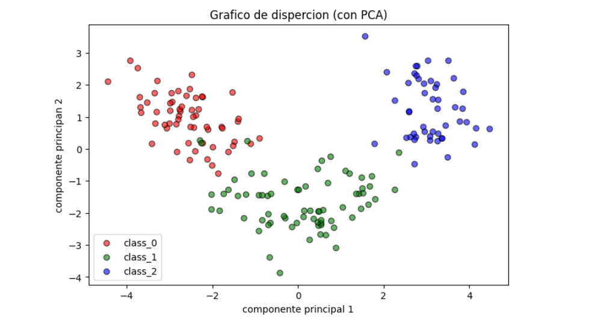

# Implementaci-n-Kmeans-y-propagaci-n-de-afinidad-
Repositorio correspondiente a un trabajo práctico donde se implementan y comparan dos algoritmos de Machine Learning utilizando el dataset “Wine Recognition” de scikit-learn.
---
## Preparación del Dataset
Los datos fueron cargados en un dataframe de Pandas y luego normalizados por medio de un pipeline restando la media y dividiendo por la desviación estándar. A los datos ya normalizados se les aplicó el algoritmo PCA disminuyendo su dimensionalidad a 2. Finalmente, estos datos fueron representados en un gráfico de dispersión.

## Algoritmos Aplicados
Por medio del comando train_test_split se separó el dataset obtenido en conjuntos de entrenamiento y prueba (30 %). A los datos de entrenamiento se les aplicó el algoritmo KMeans con diferente cantidad de clusters K (2, 3 ,4 y 5). Por último, se aplicó el algoritmo de propagación de afinidad sobre los datos de entrenamiento.

---
# Comentarios Finales

A la hora de aplicar el modelo de Affinity Propagation se utilizó el parámetro de preference para llegar a un resultado de score mayor a 90%. En este caso se aplicó en la diagonal principal el valor de –55 haciendo que el modelo se incline por un numero de clúster chico. De esta manera aplicando este hiperparametro el modelo llego a la cantidad de clúster de los subgrupos conocidos del data set que es 3 y un score de 100%.

Esta preference fue aplicada debido a que, sin ella, por defecto el modelo llena las celdas de la diagonal principal de la matriz de similitud con el valor de la mediana de las similitudes, la cantidad de clústeres a la que llegaba era 7 y el score de 52,8% siendo este valor bastante alejado del objetivo ya que encontró subestructuras (es decir que encontró otros subgrupos) que no coincidían con los de las etiquetas.

Por otro lado, al aplicarlos valores de preference mayores a –55 la cantidad de clústeres encontrada no bajaba de 4 y el score no subía de 86.7%.

También se solicitó aplicar al algoritmo de K-Means los datos de entrenamiento; este llegó a un score de 100% en el caso de 3 clústeres, lo mismo que el de Affinity Propagation. Se podría decir que en este caso (con este data set) KMeans fue más eficiente para encontrar el número de clústeres porque, aunque se probó con diferentes valores de K ocupó menos espacio de memoria y tiempo de cómputo que Afinnity Propagation .
 
